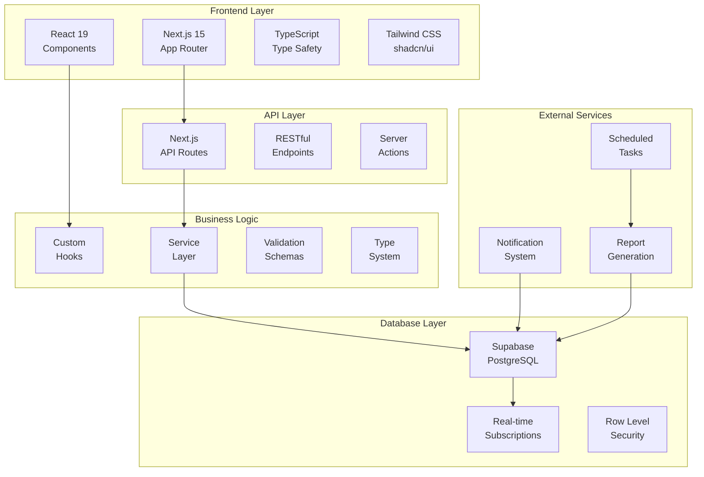
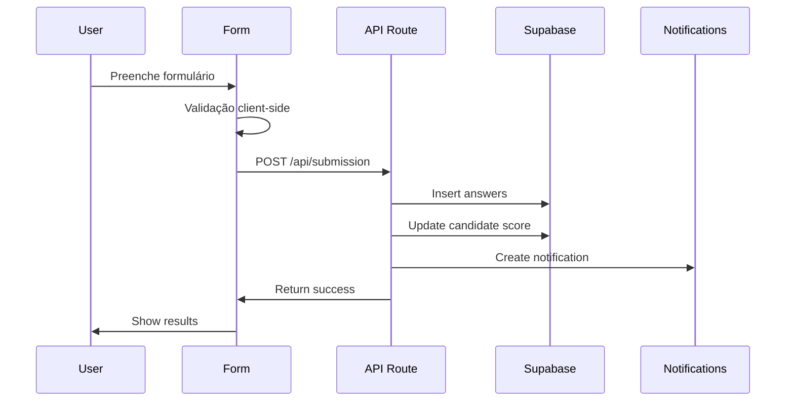
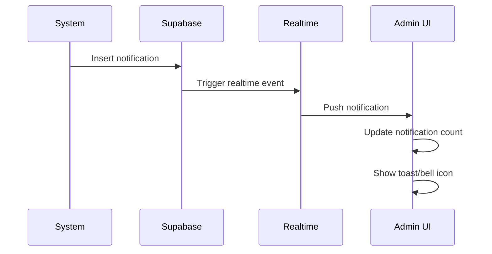

# FitScore Legal - Sistema de Avaliação de Candidatos

<div align="center">
  
  **Sistema inteligente de avaliação de candidatos com IA para processos seletivos**
  
  [](https://nextjs.org/)
  [](https://www.typescriptlang.org/)
  [](https://supabase.com/)
  [](https://tailwindcss.com/)
</div>

## 🎯 Visão Geral

O **FitScore Legal** é uma aplicação web moderna e robusta desenvolvida para automatizar e otimizar processos de avaliação de candidatos. O sistema utiliza questionários dinâmicos categorizados em **Performance**, **Energia** e **Cultura** para calcular um score de adequação (FitScore) e classificar candidatos de forma inteligente.

## 🚀 Principais Features

### 📋 Sistema de Questionários Dinâmicos
- **Múltiplos tipos de pergunta**: Única escolha, múltipla escolha e texto aberto
- **Categorização inteligente**: Performance, Energia e Cultura
- **Gerenciamento completo**: CRUD de perguntas com ativação/desativação
- **Validação em tempo real**: Usando Zod para validação robusta

### 🎯 Sistema de Scoring Inteligente
- **Cálculo automático de FitScore**: Baseado em respostas ponderadas por tipo de pergunta
- **Classificação por níveis**:
  - **Fit Altíssimo** (≥80 pontos): Candidatos ideais
  - **Fit Aprovado** (60-79 pontos): Candidatos adequados
  - **Fit Questionável** (40-59 pontos): Candidatos com gaps
  - **Fora do Perfil** (<40 pontos): Candidatos inadequados

### 📊 Dashboard Administrativo Completo
- **Estatísticas em tempo real**: Total de candidatos, taxa de conversão, score médio
- **Visualizações interativas**: Gráficos de distribuição por classificação
- **Gestão de candidatos**: Visualização detalhada, filtros avançados, paginação
- **Skeleton loaders**: Para melhor UX durante carregamentos

### 🔔 Sistema de Notificações em Tempo Real
- **Notificações push**: Usando Supabase Realtime
- **Categorização por tipo**: Sucesso, Info, Warning, Error
- **Gestão completa**: Marcar como lida, excluir, filtros
- **Persistência**: Histórico completo de notificações

### 📈 Sistema de Relatórios Automatizados
- **Relatórios programados**: Execução automática baseada em cron
- **Relatórios manuais**: Geração sob demanda
- **Múltiplos formatos**: Visualização web e exportação CSV
- **Armazenamento**: Histórico completo de relatórios gerados
- **Notificações automáticas**: Alertas quando relatórios são gerados

## 🛠️ Stack Tecnológica

### Frontend
- **Next.js**: App Router, Server Components, Client Components
- **React 19**: Hooks modernos, Suspense, Error Boundaries
- **TypeScript 5**: Type safety completo, interfaces robustas
- **Tailwind CSS 3**: Utility-first CSS framework
- **shadcn/ui**: Componentes acessíveis baseados em Radix UI

### Backend & Database
- **Supabase**: PostgreSQL com real-time, autenticação, RLS
- **Next.js API Routes**: RESTful endpoints
- **Zod**: Validação de schemas e tipos

### UI/UX & Design System
- **Radix UI**: Componentes primitivos acessíveis
- **Lucide React**: Biblioteca de ícones moderna
- **Sonner**: Sistema de toast notifications
- **next-themes**: Suporte a tema claro/escuro
- **class-variance-authority**: Variantes de componentes tipadas

### Ferramentas de Desenvolvimento
- **ESLint**: Linting e code quality
- **TypeScript**: Verificação de tipos estática
- **date-fns**: Manipulação de datas com localização pt-BR
- **clsx**: Utility para classes condicionais

## 📁 Estrutura do Projeto

```
fitscore.legal/
├── src/
│   ├── app/                          # App Router (Next.js 15)
│   │   ├── admin/                    # Área administrativa
│   │   │   ├── candidatos/           # Gestão de candidatos
│   │   │   ├── perguntas/            # Gestão de perguntas
│   │   │   ├── relatorios/           # Sistema de relatórios
│   │   │   ├── notificacoes/         # Central de notificações
│   │   │   └── layout.tsx            # Layout admin com sidebar
│   │   ├── api/                      # API Routes
│   │   │   ├── candidates/           # CRUD candidatos
│   │   │   ├── questions/            # CRUD perguntas
│   │   │   ├── notifications/        # Sistema notificações
│   │   │   ├── reports/              # Sistema relatórios
│   │   │   ├── submission/           # Submissão formulários
│   │   │   └── dashboard/            # Estatísticas
│   │   └── page.tsx                  # Formulário público
│   └── components/
│       ├── admin/                    # Componentes administrativos
│       ├── ui/                       # Design system (shadcn/ui)
│       ├── auth/                     # Componentes de autenticação
│       └── [outros componentes]
├── lib/
│   ├── hooks/                        # Custom React hooks
│   ├── services/                     # Camada de serviços
│   ├── types/                        # Definições TypeScript
│   ├── schemas/                      # Schemas Zod
│   └── supabase/                     # Configuração Supabase
└── [arquivos de configuração]
```

## 🏗️ Arquitetura Técnica



### Padrões Implementados

#### 1. **Separation of Concerns**
```typescript
// Serviços com Classes Estáticas (API)
export class ApiService {
  static async getCandidates(filters: CandidateFilters) {
    // Lógica de chamadas API
  }
}

// Funções Utilitárias (Supabase)
export async function getQuestionsForForm(): Promise<StepData[]> {
  // Lógica de negócio com Supabase
}

// Custom Hooks (Estado)
export function useNotifications() {
  // Lógica de estado e real-time
}

// Componentes (UI)
export function CandidatesPage() {
  // Apenas UI e interações
}
```

#### 2. **Type Safety Completo**
```typescript
interface Candidate {
  id: string
  name: string
  email: string
  fit_score?: number
  fit_label?: FitLabel
}

type FitLabel = 'Fit Altíssimo' | 'Fit Aprovado' | 'Fit Questionável' | 'Fora do Perfil'
```

#### 3. **Validação Robusta**
```typescript
// Validação com Zod
const candidateSchema = z.object({
  name: z.string().min(2, "Nome deve ter pelo menos 2 caracteres"),
  email: z.string().email("Email inválido"),
  phone: z.string().min(10, "Telefone deve ter pelo menos 10 dígitos")
})

// Funções de validação específicas
export function validateFormData(formData: FormData) {
  return formDataSchema.safeParse(formData)
}

export function validateMultipleChoiceLimit(selections: string[], maxLimit: number) {
  return selections.length <= maxLimit
}
```

#### 4. **Arquitetura de Serviços**
```typescript
// Classes estáticas para APIs externas
export class ApiService {
  private static baseUrl = '/api'
  static async getCandidates() { /* ... */ }
}

export class NotificationService {
  private static baseUrl = '/api/notifications'  
  static async createNotification() { /* ... */ }
}

// Funções utilitárias para lógica de negócio
export async function submitForm(formData: FormData) { /* ... */ }
export function calculateAnswerScore(type, alternatives) { /* ... */ }
```

## 🎨 Design System

### Componentes Base
- **Button**: 6 variantes (default, destructive, outline, secondary, ghost, link)
- **Card**: Sistema de cards com header, content, footer
- **Input/Textarea**: Componentes de formulário com validação
- **Dialog/Modal**: Modais acessíveis com overlay
- **Badge**: Indicadores de status com variantes
- **Skeleton**: Loading states elegantes

### Padrão de Cores
- **Primária**: Azul (#1e40af)
- **Secundária**: Cinza neutro
- **Estados**: Verde (sucesso), Vermelho (erro), Amarelo (warning)
- **Tema**: Suporte completo a modo claro/escuro

## 📊 Sistema de Dados

### Entidades Principais

```typescript
// Candidatos
interface Candidate {
  id: string
  name: string
  email: string
  phone?: string
  fit_score?: number
  fit_label?: FitLabel
  completed_at?: string
  created_at: string
  updated_at: string
}

// Perguntas
interface Question {
  id: string
  category: 'performance' | 'energia' | 'cultura'
  title: string
  description?: string
  type: 'single_choice' | 'multiple_choice' | 'open_text'
  order_index: number
  is_active: boolean
  alternatives?: Alternative[]
}

// Respostas
interface Answer {
  id: string
  candidate_id: string
  question_id: string
  alternative_id?: string
  text_answer?: string
  score: number
  created_at: string
}
```

### Relacionamentos
- **Candidate** 1:N **Answer**
- **Question** 1:N **Alternative**
- **Question** 1:N **Answer**
- **Alternative** 1:N **Answer**

## 🔄 Fluxos de Dados

### 1. Submissão de Formulário


### 2. Sistema de Notificações


## 🚀 Performance & Otimizações

### Frontend
- **Server Components**: Renderização no servidor quando possível
- **Skeleton Loading**: Estados de carregamento elegantes
- **Lazy Loading**: Componentes carregados sob demanda
- **Memoização**: React.memo e useMemo para otimizações
- **Debouncing**: Em campos de busca e validação

### Backend
- **API Routes Otimizadas**: Queries eficientes com Supabase
- **Paginação**: Implementada em todas as listagens
- **Caching**: Headers de cache apropriados
- **Validação**: Schemas Zod para validação rápida

### Database
- **Índices**: Em campos de busca frequente
- **RLS**: Row Level Security para segurança
- **Real-time**: Subscriptions otimizadas
- **Joins**: Queries otimizadas com relacionamentos

## 🧩 Complexidades Técnicas & Soluções

### 1. **Sistema de Scoring Dinâmico**
**Desafio**: Calcular scores baseados em diferentes tipos de perguntas e categorias.

**Solução**: Implementação de algoritmo de scoring ponderado que considera:
- **Single Choice**: Até 100 pontos por pergunta baseado no valor da alternativa
- **Multiple Choice**: Até 50 pontos por pergunta (limitado para evitar inflação)
- **Open Text**: 5-10 pontos baseado na qualidade/comprimento da resposta
- Validação rigorosa de pontuações para evitar gaming
- Cálculo automático do FitLabel baseado no score total

### 2. **Real-time sem Overhead**
**Desafio**: Notificações em tempo real sem impactar performance.

**Solução**: 
- Uso seletivo do Supabase Realtime apenas onde necessário
- Debouncing de eventos para evitar spam
- Cleanup automático de subscriptions
- Estados otimistas para melhor UX

### 3. **Formulários Dinâmicos Complexos**
**Desafio**: Renderizar formulários com diferentes tipos de pergunta dinamicamente.

**Solução**:
- Sistema de componentes polimórficos
- Validação condicional baseada no tipo
- Estado centralizado com custom hooks
- Navegação step-by-step com persistência

### 4. **Paginação e Filtros Avançados**
**Desafio**: Performance em listagens grandes com múltiplos filtros.

**Solução**:
- Paginação server-side
- Debouncing em filtros de busca
- Queries otimizadas com índices
- Cache inteligente de resultados

### 5. **Relatórios Programados**
**Desafio**: Execução automática de relatórios com notificações.

**Solução**:
- Sistema de cron jobs com Edge Functions
- Armazenamento estruturado de relatórios
- Notificações automáticas baseadas em eventos
- Exportação em múltiplos formatos

## 🔧 Funcionalidades Implementadas

### 📝 Formulário Público
- **Multi-step form** com navegação entre etapas
- **Validação em tempo real** com feedback visual
- **Tipos de pergunta suportados**:
  - Única escolha (radio buttons)
  - Múltipla escolha (checkboxes) 
  - Texto aberto (textarea)
- **Cálculo automático de score** ao finalizar
- **Notificações toast** para feedback do usuário

### 👨‍💼 Área Administrativa
- **Dashboard** com estatísticas em tempo real
- **Gestão de candidatos** com filtros e paginação
- **Gestão de perguntas** com CRUD completo
- **Sistema de notificações** em tempo real
- **Relatórios automatizados** com agendamento
- **Skeleton loaders** para melhor UX

### 🔔 Sistema de Notificações
- **Notificações em tempo real** via Supabase Realtime
- **Tipos de notificação**: success, info, warning, error
- **Gestão completa**: marcar como lida, excluir, filtrar
- **Histórico persistente** de todas as notificações

### 📊 Sistema de Relatórios
- **Relatórios de candidatos aprovados** (FitScore ≥ 80)
- **Execução manual** e **agendada** (cron jobs)
- **Armazenamento** de histórico de relatórios
- **Exportação CSV** dos dados
- **Modal full-screen** para visualização detalhada

## 🔐 Segurança

### Autenticação & Autorização
- **Supabase Auth**: Sistema completo de autenticação
- **RLS**: Row Level Security no banco
- **JWT**: Tokens seguros para sessões
- **HTTPS**: Comunicação criptografada

### Validação
- **Client-side**: Validação imediata com Zod
- **Server-side**: Validação dupla nas APIs
- **Sanitização**: Limpeza de dados de entrada
- **CSRF**: Proteção contra ataques

## 📱 Responsividade

### Breakpoints
- **Mobile**: < 768px
- **Tablet**: 768px - 1024px
- **Desktop**: > 1024px

### Componentes Adaptativos
- **Sidebar**: Colapsível em mobile
- **Tabelas**: Scroll horizontal em telas pequenas
- **Modais**: Full-screen em mobile
- **Cards**: Grid responsivo

## 🧪 Qualidade de Código

### Padrões Implementados
- **Clean Code**: Funções pequenas, nomes descritivos
- **SOLID**: Princípios de design aplicados
- **DRY**: Reutilização de código
- **Type Safety**: TypeScript em 100% do código
- **Error Handling**: Tratamento robusto de erros

### Ferramentas
- **ESLint**: Linting rigoroso
- **TypeScript**: Verificação de tipos
- **Prettier**: Formatação consistente
- **Husky**: Git hooks para qualidade

## 🚀 Deploy & Produção

### Recomendações de Deploy
- **Vercel**: Deploy otimizado para Next.js
- **Supabase**: Database e backend gerenciados
- **CDN**: Assets estáticos otimizados
- **Environment Variables**: Configuração segura

### Monitoramento
- **Error Tracking**: Sentry ou similar
- **Performance**: Web Vitals
- **Analytics**: Métricas de uso
- **Logs**: Estruturados e centralizados

## 📈 Métricas & Analytics

### KPIs Implementados
- **Total de Candidatos**: Número total de registros
- **Avaliações Completas**: Formulários finalizados
- **Score Médio**: Performance geral dos candidatos aprovados
- **Distribuição por FitLabel**: Fit Altíssimo, Aprovado, Questionável, Fora do Perfil
- **Candidatos Recentes**: Últimos 5 candidatos registrados

## 🔮 Roadmap Futuro

### Features Planejadas
- [ ] **IA/ML**: Análise preditiva de candidatos
- [ ] **Integração**: APIs com sistemas de RH
- [ ] **Mobile App**: Aplicativo nativo
- [ ] **Relatórios Avançados**: Dashboards interativos
- [ ] **Multi-tenancy**: Suporte a múltiplas empresas

## ⚙️ Instalação & Configuração

### Pré-requisitos
- Node.js 18+ 
- npm ou yarn
- Conta Supabase
- Git

### 1. Clone o Repositório
```bash
git clone https://github.com/legal/fitscore.legal.git
cd fitscore.legal
```

### 2. Instale as Dependências
```bash
npm install
```

### 3. Configuração do Ambiente
Crie um arquivo `.env.local`:
```env
NEXT_PUBLIC_SUPABASE_URL=your_supabase_url
NEXT_PUBLIC_SUPABASE_ANON_KEY=your_supabase_anon_key
SUPABASE_SERVICE_ROLE_KEY=your_service_role_key
```

### 4. Configure o Banco de Dados
Configure as tabelas no Supabase Dashboard ou via SQL:

**Tabelas principais:**
- `candidates` - Dados dos candidatos
- `questions` - Perguntas do questionário  
- `alternatives` - Alternativas das perguntas
- `answers` - Respostas dos candidatos
- `notifications` - Sistema de notificações
- `scheduled_reports` - Relatórios programados
- `generated_reports` - Histórico de relatórios

### 5. Execute o Projeto
```bash
npm run dev
```

### 6. Acesse a Aplicação
- **Frontend Público**: http://localhost:3000
- **Admin Dashboard**: http://localhost:3000/admin

---

## 🤝 Contribuição

Este projeto segue padrões rigorosos de qualidade e arquitetura. Para contribuir:

1. **Fork** o repositório
2. **Crie** uma branch para sua feature
3. **Implemente** seguindo os padrões estabelecidos
4. **Teste** completamente sua implementação
5. **Submeta** um Pull Request detalhado

## 📄 Licença

Este projeto é propriedade da **LEGAL** e está protegido por direitos autorais.

---

<div align="center">
  <strong>Desenvolvido com ❤️ pela equipe LEGAL</strong>
  <br>
  <em>Sistema de avaliação inteligente para processos seletivos modernos</em>
</div>